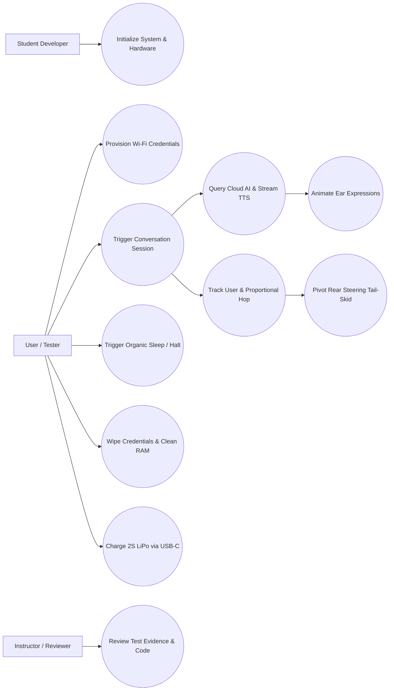
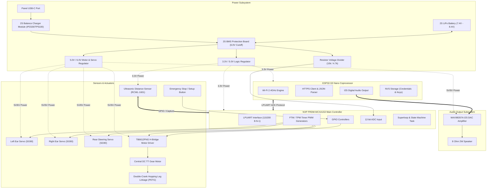

# Mecha-Iepurele (Mechanized Bunny)

**Author:** Alice Dobre
**Date:** 2026-07-20  

> Documentation draft generated from Agent 0 and Agent 1 outputs.  
> AI assists. Humans decide.

## 1. Introduction

Mecha-Iepurele (Mechanized Bunny) is an interactive, moving robotic companion designed for indoor flat surfaces (classroom, table, or smooth floor). The robot engages in natural conversations with humans via a cloud-based Conversational AI API and physically tracks and follows the user. High-level network operations (Wi-Fi connectivity, HTTPS API transactions, JSON payload parsing, and direct Text-to-Speech audio rendering via an I2S DAC) are offloaded to an ESP32 coprocessor suite (ESP32-S3 Nano), while low-level motor control loops, servo ear, active steering, battery monitoring, and sensor processing are managed by the main microcontroller board.

The purpose of this project is to create an engaging physical robotic companion that bridges low-level embedded hardware (sensors, motor drivers, PWM actuators, power management) with cloud-based artificial intelligence. The project originated from a concept for a mechanized bunny that talks to users, mimics emotional expressions based on conversation mood, and follows the user.

This project is especially valuable for third-year Computer Science students participating in the Embedded Engineering and Gen AI Summer School, as it teaches core embedded concepts (UART communication, PWM signal generation, I2C/I2S interfacing, control loops, power isolation, and software debouncing) as well as networking, API parsing, privacy protection, and system integration.

The **NXP FRDM-MCXA153 board featuring the NXP MCXA153 MCU** is selected as the mandatory target controller for all summer school projects. It provides Arm Cortex-M33 real-time processing, low-power timer peripherals, LPUART interfaces, and ADC channels required for local actuator control and sensor processing.

> This documentation is a draft and must be validated by students and instructors before implementation.

---

## 2. General Description

### 2.1 Project Summary

- **Project Name:** Mecha-Iepurele (Mechanized Bunny)
- **Author / Student Team:** TODO: Add Student Author(s) Name(s) and Student ID(s)
- **Short Summary:** An interactive, moving mechanized bunny robot that communicates with a human via an AI API (over ESP32 Wi-Fi) and mimics emotional expressions using physical movement (ear sweeps states).
- **Main Objective:** Build a robotic companion that uses a FRDM-MCXA153 board for local sensor-motor control and expressions, and an ESP32-S3 Nano for Wi-Fi connection to a cloud conversational AI API that provides responses and mood data.
- **Intended Users:** Third-year university Computer Science students and summer school reviewers/instructors.
- **Operating Environment:** Indoor flat surfaces (classroom, laboratory table, or smooth floor) with active Wi-Fi connectivity.
- **Selected Scope:** Recommended Summer School Version featuring mobile hopping locomotion via a single central DC motor driving a double-crank axle, active steering via a rear tail-skid servo, ear expression servos, ultrasonic user tracking, direct I2S TTS voice output on the ESP32, and onboard USB-C 2S LiPo balance charging.
- **Main Behavior:** Upon boot, the bunny initializes peripherals and connects to Wi-Fi. When user conversation is triggered, the ESP32 queries the cloud AI API, receives text response and mood data, and streams TTS voice output through an I2S DAC/speaker. The ESP32 sends servo targets to the MCXA153 via UART (with ACK confirmation). The MCXA153 updates ear servos (drooping for sad, perking for happy) state. Concurrently, a 50 ms motor control loop reads an ultrasonic sensor to track user distance (maintaining 30–50 cm) and drives the central hopping DC motor and steering tail-skid servo to follow the user smoothly.
- **Inputs:**
  - Ultrasonic distance sensor (RCWL-1601 / HC-SR04P, 3.3V compatible) measuring user distance.
  - Tactile physical buttons (setup / Wi-Fi provisioning / emergency stop).
  - Wi-Fi connection to Cloud LLM/NLP API (via ESP32-S3 Nano coprocessor).
  - Battery voltage diagnostic signal via resistor divider to ADC.
- **Outputs:**
  - 1x Central high-torque DC TT gear motor (via TB6612FNG H-bridge driver) for 90-degree kick hopping locomotion.
  - 4x SG90 Micro Servos (2x ears, 1x rear steering tail-skid).
  - MAX98357A I2S Audio DAC + 8 Ohm 2W speaker (driven directly by ESP32-S3 Nano).
- **Out-of-Scope Items:**
  - On-board execution of heavy Large Language Models (LLMs) or local Speech-to-Text on the MCXA153.
  - High-speed navigation on rough terrain or stairs.
  - Complex multi-obstacle collision avoidance beyond tracking the primary user.
  - Custom cloud backend hosting (standard pre-existing HTTP REST AI endpoints are assumed).
  - Status LEDs (all status feedback is expressed organically through physical ear movements).
  - OLED screen displays and local web input pages (in the speech TTS direct-drive edition).

### 2.2 Feature Tiers

| Tier | Description | Main Features | Extra Components | Main Risks | Suitability |
|---|---|---|---|---|---|
| **Core** | Static Ear desktop prototype in shell | ESP32-S3 Nano Wi-Fi handshake, queries mock/REST API, direct TTS audio via I2S MAX98357A DAC, MCXA153 drives 2x ear servos, NVS data wiping, UART ACK comms | ESP32-S3 Nano, MAX98357A DAC + Speaker, 2x Ear Servos, 3D Printed Shell & Brackets | UART framing errors, Wi-Fi handshake timeout, API parsing failure | **High suitability:** Focuses on serial comms, basic GPIO, and PWM servo control. Realistic for early development. |
| **Recommended** | Mobile Speech Companion (Selected Target Scope) | All Core features plus differential hopping leg linkage (1x central DC TT motor + H-bridge) executing gentle 90-degree kicks, active steering rear tail-skid, ultrasonic distance tracking (30–50 cm window), 50 ms motor loop, battery ADC monitoring (<6.4V sleep), 2S LiPo balance charging via USB-C port, magnetic quick-release ventilated shell | 1x DC TT Motor, TB6612FNG Driver, 3.3V Ultrasonic Sensor, 2S LiPo Battery & BMS, 2S USB-C Balance Charger Module, 4x Servos (Ears, Steering), USB-C Panel Cable, MR85ZZ Bearings, PETG/TPU Filaments | Mechanical binding, leg joint wear, high component density heat, ground impact shock, battery over-discharge | **Good with guidance:** Combines PWM, control loops, mechanical kinematics, power isolation, and safety. Excellent depth. |
| **Advanced** | Voice-Input Speech Companion | All Recommended features plus local I2S MEMS microphone (INMP441) on ESP32-S3 Nano for voice command streaming, wake-word detection / TinyML keyword spotting, local fuel gauge | INMP441 I2S MEMS Mic, LiPo Fuel Gauge IC, Camera module (ESP32-CAM / HuskyLens) | Acoustic feedback loops, double-buffered I2S timing, high power draw, memory limits | **Low (Optional extension):** Suitable only as a capstone extension for advanced teams due to time limits. |

### 2.3 Scenarios

| ID | Scenario | Description |
|---|---|---|
| `SC-001` | Startup / Setup | Device powers on. MCXA153 initializes GPIOs, LPUART, ADC, and PWM timers. ESP32-S3 Nano reads Wi-Fi credentials from NVS and connects to Wi-Fi. Upon successful connection, ESP32 sends "Online" byte over UART. MCXA153 sweeps ears to neutral to confirm awake state. |
| `SC-002` | Dynamic Wi-Fi Provisioning | If Wi-Fi fails within 15 seconds or setup button is held for 5 seconds at boot, ESP32 launches an Access Point setup portal. Ears move slowly to indicate search state. User connects via smartphone, submits credentials, and ESP32 connects and the ears showing attention state. |
| `SC-003` | Multi-User Device Wiping | Tester A finishes testing. Tester A holds setup button for 10 seconds. ESP32 erases all stored Wi-Fi credentials, tokens, and caches from NVS, reboots, sweeps ears to neutral to sleep. |
| `SC-004` | Onboard Battery Charging | When battery drops below 6.4V, MCXA153 halts motors. User plugs standard 5V USB-C cable into shell port. Integrated 2S balance charger charges cells to 8.4V. |
| `SC-005` | Normal Operation & Speech Playback | Conversation is triggered. ESP32 queries Cloud AI REST API, receives JSON (response text, mood tag, servo angles), extracts servo targets, and requests TTS audio stream. ESP32 renders audio via I2S to MAX98357A DAC. |
| `SC-006` | Active Privacy Cleansing | Speech playback completes. ESP32 immediately fills audio buffers and text RAM strings with zeros (`0x00`). Subsequent API calls use a newly generated, isolated session UUID to prevent user profiling. |
| `SC-007` | Actuator Expression Control | ESP32 sends parsed servo angles and mood data over LPUART to MCXA153. MCXA153 updates FTM/TPM PWM registers, driving ear servos to sweep to target angles (drooping for sad, perking for happy). |
| `SC-008` | Distance Sensor Processing | MCXA153 runs a periodic 50 ms motor loop. It triggers the ultrasonic sensor with a 10 us pulse, measures Echo pin return duration, and calculates distance in centimeters. |
| `SC-009` | Proximity Hopping & Steering | User is detected at 80 cm, offset right. MCXA153 drives central DC motor via PWM. Shared double-crank axle sweeps leg linkages past 90 degrees vertical, executing a gentle downward shove that hops chassis forward. Simultaneously, steering servo pivots rear tail-skid right for a smooth turn, slowing down as distance reaches 30–50 cm window. |
| `SC-010` | Safety & Reliability (Sleep Halt) | Emergency stop button is pressed, sensor Echo hangs >250 ms, or battery falls <6.4V. MCXA153 forces motor PWM to 0%, pulls motor driver STBY low, centers steering servo, droops ears to asleep state. |

### 2.4 User Stories

| ID | User Story |
|---|---|
| `US-001` | As a student developer, I need to use the NXP FRDM-MCXA153 board, so that the project complies with the course's mandatory hardware platform. |
| `US-002` | As a user, I need the bunny to dynamically connect to different Wi-Fi networks using a setup mode, so that I can easily bring the companion to new environments. |
| `US-003` | As a tester, I need to easily wipe my Wi-Fi credentials and conversation logs from the device, so that my personal network keys and private voice contents are not exposed to subsequent testers. |
| `US-004` | As a tester, I need the communication to be encrypted and my conversation session ID to be isolated, so that my conversations cannot be intercepted on local Wi-Fi or linked to other testers' profiles. |
| `US-005` | As a user, I need the bunny to convey its state of sleep and activity through physical movements of the ears, so that it looks like an organic creature without unnatural flashing LEDs. |
| `US-006` | As a developer, I need to power the motors and microcontrollers from a single large LiPo battery with separate regulators, so that logic circuitry is fully isolated from motor transients. |
| `US-007` | As a user, I want the bunny to move by hopping like a real rabbit, utilizing a robust leg linkage system that avoids binding, joint wear, and synchronization failures. |
| `US-008` | As a builder, I need structural mounts and leg linkages printed with PETG filament and low-friction bearings, so that the hopping mechanism has high toughness and structural durability. |
| `US-009` | As a builder, I need a spacious ventilated body shell with magnetic latches, an onboard USB-C 2S balance charger, and a 2S BMS protection board, so that components fit safely and battery charging is convenient and safe. |
| `US-010` | As a student builder with a 7-week project timeline, I need pre-designed mechanical model templates (STL/STEP) to build from, or I must strictly limit custom Blender CAD learning and design to a maximum of 1 week. |
| `US-011` | As a user, I need the bunny to be able to take motion turns when necessary, so that it can steer around obstacles or track my position as I turn corners. |
| `US-013` | As a builder, I want a non-piston leg linkage that hops the whole body by rotating the leg to 90 degrees relative to the body, executing a gentle low-amplitude hop to keep the movement stable and protect components. |

### 2.5 Use Case Diagram



### 2.6 Hardware and Software Block Diagram



**System Architecture Explanations:**

- **Power Flow:** Power originates from a 2S LiPo battery pack (7.4V nominal, 8.4V max) connected through a 2S BMS protection board (6.0V cutoff). Power is split into two independent buck/LDO regulators: a digital logic regulator supplying 3.3V to the MCXA153, ESP32-S3 Nano, and ultrasonic sensor; and a motor/actuator regulator supplying 5.0V/6.0V to the TB6612FNG driver, MAX98357A DAC, and 4x SG90 servos. An onboard 2S USB-C balance charger (IP2326 or TP5100) charges the pack via a shell-mounted USB-C port.
- **Data & Control Flow:** The ESP32-S3 Nano executes Wi-Fi handshakes and cloud HTTPS transactions. Audio data streams directly over I2S to the MAX98357A DAC and speaker. Parsed servo targets, mood data, and system commands are sent to the MCXA153 over LPUART at 115200 baud. The MCXA153 validates checksums, returns software ACK bytes, updates servo PWM registers, and executes the 50 ms ultrasonic distance tracking loop to modulate the central DC motor and steering servo.
- **Compatibility Concerns:** MCXA153 GPIO pins operate strictly at 3.3V (max 4 mA per pin). Motor and servo power rails must never connect to MCU logic pins. A 3.3V-compatible ultrasonic sensor (RCWL-1601) is used, or a 10k/4.7k resistor divider is inserted on the Echo pin if using 5V HC-SR04 models. Battery voltage (up to 8.4V) is scaled down via a 10k/4.7k divider so the ADC receives <= 2.68V.
- **Protection & Decoupling:** Decoupling capacitors (100 uF electrolytic + 0.1 uF ceramic) are placed across power rails near the motor driver and servos to suppress inductive current spikes and prevent MCU brownouts. A freewheeling diode protection network is integrated inside the TB6612FNG driver.
- **Datasheet Checks Required:**
  - NXP MCXA153 reference manual: verify LPUART0 pin muxing, FTM/TPM timer channel assignments, and 12-bit ADC input channels.
  - TB6612FNG datasheet: check VM logic input ranges, logic VCC (3.3V), and STBY pin pull-down behavior.
  - MAX98357A datasheet: verify bit clock (BCLK), word select (LRCK), and serial data (SDIN) timing parameters for ESP32 I2S.
  - 2S BMS & Charger datasheets: confirm overcharge threshold (4.25V) and over-discharge threshold (3.0V per cell).

---

## 3. Hardware Design

### 3.1 Bill of Materials

| # | Component | Qty | Tier | Purpose | Likely Interface | Voltage / Power Notes | Risks / Checks |
|---|---:|---:|---|---|---|---|---|
| 1 | NXP FRDM-MCXA153 | 1 | Core | Central low-level MCU board for motor loop, PWM servos, ADC, and distance timing | LPUART, PWM, GPIO, ADC | 3.3 V Logic; Powered via USB-C or regulated 3.3V pin | Mandatory board. Verify pinout and 3.3V logic boundaries. |
| 2 | ESP32-S3 Nano | 1 | Core | Wi-Fi coprocessor, HTTPS API client, JSON parser, I2S audio renderer, NVS storage | LPUART, I2S, Wi-Fi | 3.3 V Logic; Powered via regulated 3.3V rail | Confirm NVS data wiping and 115200 baud UART link. |
| 3 | MAX98357A I2S DAC | 1 | Core | Direct digital audio decoding and amplification for voice TTS output | I2S (BCLK, LRCK, DIN) | Powered via 5V rail; 3.3V I2S logic from ESP32 | Audio noise from power ripples; route I2S away from UART. |
| 4 | Dynamic Speaker (8 Ohm, 2W) | 1 | Core | Voice TTS output speaker | Direct wire to DAC | Driven by MAX98357A DAC output | Ensure secure mounting inside head/body shell. |
| 5 | SG90 Micro Servos | 4 | Core / Rec | Physical actuators: 2x Ears, 1x Rear Steering Tail-skid | FTM/TPM PWM (50 Hz) | 5V Power rail; 3.3V PWM control logic | Current spikes during stall can reset MCU; use dedicated 5V regulator. |
| 6 | High-Torque DC TT Gear Motor | 1 | Recommended | Drives shared double-crank axle for 90-degree kick hopping locomotion | PWM + 2x GPIO (TB6612) | Powered via 5V-6V motor regulator rail | Inductive noise spikes; require freewheeling diodes & decoupling. |
| 7 | TB6612FNG H-Bridge Motor Driver | 1 | Recommended | Controls speed and direction of central DC gear motor | PWM, 2x GPIO, STBY pin | VM 5V-6V, VCC 3.3V logic | Verify STBY pin default low for safe shutdown. |
| 8 | Ultrasonic Distance Sensor (RCWL-1601) | 1 | Recommended | Measures distance to user (30-50 cm window) for proportional following | GPIO Trigger / Echo Capture | 3.3V Power & Logic | Sensor timeout hang; software 250ms watchdog required. |
| 9 | 2S LiPo Battery Pack (7.4V, 1500+ mAh) | 1 | Recommended | Main power source for mobile robot | 2S JST-XH balance + XT30/T-plug | 7.4V nominal (8.4V max, 6.0V cutoff) | Fire / thermal hazard; requires BMS board & balance charger. |
| 10 | Dual Buck / LDO Regulators | 2 | Recommended | Independent voltage regulation: 1x 3.3V logic, 1x 5V/6V motor & servos | Power rails | Input 7.4V; Output 3.3V and 5.0V | Heat dissipation; check continuous current ratings (>= 2A for motor rail). |
| 11 | 2S USB-C Balance Charger Module (IP2326/TP5100) | 1 | Recommended | Onboard USB-C balance charging for 2S battery pack | USB-C input, 2S balance output | Input 5V USB-C; Output 8.4V balance charge | Verify auto cut-off at 8.4V. |
| 12 | 2S LiPo BMS Protection Board | 1 | Recommended | Battery safety cutoff (overcharge, over-discharge, overcurrent) | Series battery connection | Cutoff at 6.0V overall pack voltage | Verify overcurrent protection >= 4A. |
| 13 | USB-C Panel Mount Extension Cable | 1 | Recommended | Exposes charging port to outer body shell | USB-C | 5V 2A pass-through | Ensure solid mounting on shell exterior. |
| 14 | MR85ZZ Ball Bearings | 8-12 | Recommended | Low-friction pivot bearings for double-crank leg linkages | Mechanical press-fit | N/A | Prevents mechanical binding and motor stalls. |
| 15 | Neodymium Magnets (4x2 mm) | 8-12 | Recommended | Toolless quick-release magnetic latches for outer body shell | Mechanical recess | N/A | Allows instant access to debugger and internal electronics. |
| 16 | M3 Socket Fastener Kit | 1 pack | Core / Rec | Structural assembly screws, nylon locknuts, and washers | Mechanical | N/A | Ensure nylon locknuts prevent loosening during hopping. |
| 17 | Tactile Push Buttons | 2 | Core / Rec | Setup / Wi-Fi provisioning button & Emergency Stop button | GPIO with internal pull-up | 3.3V Logic | Software debouncing required (20 ms window). |
| 18 | PETG 3D Filament | ~300g | Recommended | Structural mounts, crank arms, steering brackets, leg links | 3D Printed | N/A | High impact toughness required for hopping landing stress. |
| 19 | TPU 3D Filament | ~100g | Recommended | Flexible feet landing pads and shock absorbers | 3D Printed | N/A | Shore hardness ~95A for ground traction and shock damping. |
| 20 | PLA 3D Filament | ~300g | Recommended | Spacious outer body shell (~180x120x120 mm) with ventilation grilles | 3D Printed | N/A | Non-stress enclosure. Sourced STL files recommended. |

### 3.2 Hardware Block Diagram Description

The Mecha-Iepurele hardware architecture is organized around a dual-processor design to isolate real-time motor and sensor control from network latency:

- **Main Controller (NXP FRDM-MCXA153):** Serves as the central low-level executive. It runs a deterministic 50 ms superloop that handles PWM generation for 4x SG90 servos (left ear, right ear, , rear steering tail-skid), PWM speed and direction control for the central DC motor via the TB6612FNG H-bridge, GPIO pulse timing for the ultrasonic distance sensor, ADC voltage sampling for battery diagnostic monitoring, and UART packet parsing with ACK generation.
- **Coprocessor (ESP32-S3 Nano):** Manages all high-level Wi-Fi communications, TLS encryption, REST API transactions with the cloud AI endpoint, JSON response extraction, NVS credential storage/wiping, and direct I2S digital audio decoding to the MAX98357A DAC.
- **Power Architecture:** Powered by a single 2S LiPo battery pack (7.4V nominal, 8.4V max). Safety boundaries are enforced by a 2S BMS protection board that disconnects power if overall pack voltage drops to 6.0V (3.0V per cell) or current exceeds 4A. Two independent voltage regulators are fed from the BMS output: a 3.3V logic regulator powers the MCXA153, ESP32-S3 Nano, and ultrasonic sensor; a separate 5.0V/6.0V high-current regulator powers the TB6612FNG motor driver, 4x SG90 servos, and MAX98357A audio DAC. Battery voltage is monitored via a 10k / 4.7k resistor voltage divider connected to an ADC pin on the MCXA153 (delivering <= 2.68V at fully charged 8.4V). Onboard balance charging is achieved via an IP2326 or TP5100 2S balance charger module connected to a panel-mounted USB-C port on the outer shell.
- **Sensors & Actuators:**
  - *Ultrasonic Distance Sensor:* RCWL-1601 (3.3V native) mounted on the front chest/head to measure user distance.
  - *Hopping Locomotion:* 1x central DC TT gear motor drives a shared double-crank axle. Left and right leg linkages are physically locked in phase to the axle, preventing tipping. The leg linkages act as rotary levers; when sweeping through the 90-degree vertical angle relative to the chassis, they execute a gentle downward shove against the ground, lifting the body 5–15 mm into a forward hop/scoot. MR85ZZ ball bearings at all pivot joints minimize friction, while TPU pads on the feet absorb landing shock.
  - *Active Steering:* An SG90 micro servo pivots a rear tail-skid or caster assembly left/right by +/-30 degrees to steer the robot dynamically during hopping.
  - *Organic Expression Actuators:* 2x SG90 servos sweep the ears (drooped = sad, perked = happy/listening, neutral = idle);
- **Protection & Compatibility:** Logic connections between 3.3V MCU pins and 5V components use resistor dividers or 3.3V native modules. Decoupling capacitors (100 uF electrolytic + 0.1 uF ceramic) buffer voltage dips near the motor driver and servos. Datasheet reviews must verify pin mux assignments in MCUXpresso Config Tool, LPUART baud rate clocks, and ADC reference voltage calibration.

### 3.3 Pin Allocation Draft

Generic FRDM-MCXA153 capability only - exact pin requires board pinout and datasheet verification.

| Component | Tier | Signal | Required MCU Capability | Suggested Pin / Capability | Voltage Level | Direction | Interface | Verification Needed |
|---|---|---|---|---|---|---|---|---|
| ESP32-S3 Nano | Core | UART_TX | LPUART RX input | Generic LPUART0_RX | 3.3 V | Input | UART (115200) | Confirm configuration matches LPUART peripheral routing in MCUXpresso Pin Mux tool. |
| ESP32-S3 Nano | Core | UART_RX | LPUART TX output | Generic LPUART0_TX | 3.3 V | Output | UART (115200) | Verify TX buffer is set to push-pull drive and baud rate clock is accurate. |
| Battery Sense | Rec | BATT_VSENSE | ADC Analog Input | Generic ADC Channel | <= 2.68 V | Input | Analog ADC | Verify 10k/4.7k resistor divider output does not exceed 3.3V at 8.4V max battery charge. |
| Left Ear Servo | Core | SERVO_PWM_L | Timer PWM output (FTM/TPM) | Generic PWM Channel 0 | 3.3V Logic / 5V Power | Output | PWM (50 Hz) | Scope PWM pulse widths (1.0 - 2.0 ms) under load; confirm 20 ms period. |
| Right Ear Servo | Core | SERVO_PWM_R | Timer PWM output (FTM/TPM) | Generic PWM Channel 1 | 3.3V Logic / 5V Power | Output | PWM (50 Hz) | Verify servo operates smoothly without causing MCU brownouts. |
| Steering Servo | Rec | SERVO_PWM_STEER | Timer PWM output (FTM/TPM) | Generic PWM Channel 5 | 3.3V Logic / 5V Power | Output | PWM (50 Hz) | Verify PWM controls rear tail-skid steering angle (+/-30 degrees) without binding. |
| Motor Driver (TB6612) | Rec | MOTOR_PWM | Timer PWM output (FTM/TPM) | Generic PWM Channel 2 | 3.3 V | Output | PWM (10 kHz) | Verify speed modulation carrier frequency of central DC TT motor. |
| Motor Driver (TB6612) | Rec | MOTOR_DIR1 | GPIO Output | Generic GPIO pin | 3.3 V | Output | GPIO | Check forward/reverse direction transitions. |
| Motor Driver (TB6612) | Rec | MOTOR_DIR2 | GPIO Output | Generic GPIO pin | 3.3 V | Output | GPIO | Verify complementary logic state to DIR1. |
| Motor Driver (TB6612) | Rec | STBY | GPIO Output | Generic GPIO pin | 3.3 V | Output | GPIO | Verify internal/external pull-down puts motor driver in standby on reset/fault. |
| Ultrasonic Sensor | Rec | TRIG | GPIO Output | Generic GPIO pin | 3.3 V | Output | GPIO Pulse | Confirm 10 us trigger pulse duration accuracy via SysTick/timer. |
| Ultrasonic Sensor | Rec | ECHO | GPIO Input Capture / Interrupt | Generic Input Capture pin | 3.3 V (level-shifted) | Input | Pulse Width | Verify level shifting / 3.3V sensor compatibility on Echo pulse return line. |
| Emergency Stop | Rec | STOP_BTN | GPIO Input with Pull-up | Generic Interrupt GPIO | 3.3 V | Input | GPIO (Interrupt) | Verify internal pull-up resistor and software debouncing (20 ms window). |
| Setup / Provisioning | Core | SETUP_BTN | GPIO Input with Pull-up | Generic Interrupt GPIO | 3.3 V | Input | GPIO (Interrupt) | Verify 5s hold launches AP mode and 10s hold formats NVS storage. |

*Note: All I2S connections (BCLK, LRCK, DIN) to the MAX98357A DAC are routed directly from the ESP32-S3 Nano GPIO pins and are not connected to the MCXA153.*

### 3.4 Electrical Schematics

- `TODO: Add final schematic image or link.`
- `TODO: Add motor driver wiring diagram.`
- `TODO: Add sensor connection diagram.`
- `TODO: Add power distribution diagram.`

### 3.5 Signal Diagrams and Measurements

- `TODO: Add ultrasonic sensor Trigger and Echo signal capture.`
- `TODO: Add LPUART serial debug capture showing ACK packet transmission.`
- `TODO: Add power rail voltage measurement during motor startup and leg kick.`
- `TODO: Add total current measurement during hopping locomotion and speech output.`
- `TODO: Add timing analysis plot for the 50 ms motor loop and UART responsiveness.`

---

## 4. Software Design

### 4.1 Development Environment

- **Target Microcontroller:** NXP MCXA153 (Arm Cortex-M33) on FRDM-MCXA153 development board.
- **Coprocessor:** ESP32-S3 Nano (Dual-core Xtensa LX7).
- **IDE & Toolchain:** MCUXpresso VS Code Edition or MCUXpresso IDE.
- **SDK & Software Framework:** NXP MCUXpresso SDK for MCXA153 (`fsl_lpuart`, `fsl_gpio`, `fsl_tpm`/`fsl_ftm`, `fsl_adc16`, `fsl_clock`).
- **ESP32 Toolchain:** ESP-IDF or Arduino IDE with ESP32 board support package (handling Wi-Fi, mbedTLS, HTTP client, cJSON, and I2S driver).
- **Programming Language:** C (C99 standard).
- **Debugging Hardware:** On-board MCU-Link / SWD (Serial Wire Debug) debugger and USB-UART serial logging.

If development tools are unresolved, consult: `TODO: Confirm exact development environment, SDK version, build system, and flashing/debugging workflow.`

### 4.2 Firmware Architecture

- **Architecture Style:** Dual-processor asynchronous model. The MCXA153 executes a bare-metal superloop with periodic timer tasks, while the ESP32-S3 Nano handles event-driven networking and audio tasks.
- **Reason for Choice:** Separates real-time sensor processing and motor/servo timing on the MCXA153 from network latency, SSL handshakes, and audio buffering on the ESP32.
- **Main Firmware Modules (MCXA153):**
  - `main.c`: Superloop coordination, state machine management, and SysTick scheduler.
  - `uart_comm.c`: LPUART driver, RX frame buffer, CRC checksum validation, and ACK packet transmission.
  - `motor_driver.c`: TB6612FNG H-bridge direction and PWM speed control for central DC TT motor.
  - `servo_ears.c`: PWM angle generation (50 Hz) for left and right ear expression servos.
  - `steering_control.c`: PWM angle control (50 Hz) for rear tail-skid steering servo (+/-30 degrees).
  - `ultrasonic.c`: Trigger pulse generation and Echo input capture for distance measurement.
  - `battery_adc.c`: ADC 12-bit voltage sampling and under-voltage threshold check (<6.4V).
- **Startup Sequence:**
  1. Disable global interrupts.
  2. Configure system clocks to 48 MHz core frequency.
  3. Initialize GPIO ports, enabling internal pull-ups for buttons and default low states for motor driver STBY.
  4. Initialize LPUART0 peripheral (115200 baud, 8-N-1) and enable RX interrupts.
  5. Initialize FTM/TPM timers: TPM0 for motor PWM (10 kHz), TPM1 for ear, and steering servos (50 Hz).
  6. Initialize ADC peripheral (12-bit) and calibrate battery voltage channel.
  7. Configure SysTick timer for 1 ms tick interrupts.
  8. Enable global interrupts.
  9. Poll for ESP32 online handshake byte; upon receipt, sweep ears to neutral.
- **Main Loop / Task Flow (50 ms Loop):**
  - *Task 1 (LPUART Frame Check):* Parse incoming bytes from ESP32. If CRC is valid, send ACK byte (`0x06`) and update ear servo targets.
  - *Task 2 (Distance Tracking & Motor Control):* Trigger ultrasonic pulse, capture Echo width, and calculate distance. If Echo hangs >250 ms, enter safe shutdown. If distance is valid, compute error against 30–50 cm target window, adjust central DC motor PWM duty cycle and rear steering angle.
  - *Task 3 (Battery Check):* Sample battery ADC. If V < 6.4V, halt motor, droop ears, center steering to sleep.
  - *Task 4 (Watchdog Feed):* Refresh coprocessor watchdog timer.
- **Error Handling & Safe-State Strategy:**
  If UART communication drops for >3.0 s, battery voltage falls <6.4V, ultrasonic Echo hangs >250 ms, or emergency stop is pressed, the MCU immediately transitions to `SAFE_SHUTDOWN`. Central motor PWM is forced to 0%, motor driver STBY is pulled low, steering servo is centered, ears are drooped.
- **Configuration Constants:**
  - `BAUD_RATE`: 115200
  - `SERVO_PWM_FREQ_HZ`: 50
  - `MOTOR_PWM_FREQ_HZ`: 10000
  - `TARGET_DIST_MIN_CM`: 30 (AI Assumption)
  - `TARGET_DIST_MAX_CM`: 50 (AI Assumption)
  - `BATTERY_LOW_CUTOFF_V`: 6.4 (AI Assumption)
  - `UART_TIMEOUT_MS`: 3000 (AI Assumption)
  - `SENSOR_TIMEOUT_MS`: 250 (AI Assumption)

### 4.3 Main Algorithms and Data Structures

- **State Machine:** Enums defining system states: `STATE_INIT`, `STATE_WIFI_PROVISION`, `STATE_IDLE_AWAKE`, `STATE_CONVERSING`, `STATE_TRACKING_HOP`, `STATE_LOW_BATTERY`, `STATE_SAFE_SHUTDOWN`.
- **Proportional Distance Control Algorithm:**
  ```text
  distance = read_ultrasonic_cm()
  if (distance > TARGET_DIST_MAX_CM) {
      error = distance - TARGET_DIST_MAX_CM
      motor_speed = clamp(BASE_SPEED + Kp * error, MIN_SPEED, MAX_SPEED)
      set_motor_direction(FORWARD)
  } else if (distance < TARGET_DIST_MIN_CM) {
      error = TARGET_DIST_MIN_CM - distance
      motor_speed = clamp(BASE_SPEED + Kp * error, MIN_SPEED, MAX_SPEED)
      set_motor_direction(REVERSE)
  } else {
      motor_speed = 0
      set_motor_direction(STOP)
  }
  ```
- **Steering Control Algorithm:** Adjusts rear tail-skid servo angle based on relative obstacle position or steering command offset (+/-30 degrees relative to center).
- **UART Frame Data Structure:**
  ```c
  typedef struct {
      uint8_t header;       // 0xAA
      uint8_t cmd_type;     // 0x01 = Servo update, 0x02 = Mood, 0x03 = Status
      int8_t  ear_left_deg; // Angle 0 - 180
      int8_t  ear_right_deg;// Angle 0 - 180
      int8_t  steer_deg;    // Steering offset -30 to +30
      uint8_t crc8;         // Checksum
  } uart_payload_t;
  ```
- **Privacy Buffer Zero-Fill Routine:**
  Immediately after TTS playback completes on the ESP32, `memset(audio_buffer, 0, sizeof(audio_buffer))` and `memset(text_buffer, 0, sizeof(text_buffer))` are called to overwrite sensitive conversation contents in RAM.

### 4.4 Functional Requirements Summary

| ID | Tier | Requirement | Priority | Verification | Acceptance Criterion |
|---|---|---|---|---|---|
| `FR-001` | Core | The system shall use the NXP FRDM-MCXA153 board as the main controller for low-level sensor-motor control and real-time execution. | Must | Inspection | BOM confirms MCXA153 handles low-level actuator drive and real-time loop tasks. |
| `FR-002` | Core | The system shall use the ESP32-S3 Nano as the Wi-Fi, API, and audio parsing coprocessor. | Must | Inspection | Physical board layout includes the ESP32-S3 Nano connected to the MCXA153. |
| `FR-003` | Core | Upon power-on, MCXA153 shall initialize GPIOs, LPUART, ADC, and PWM timers, sweep ears to neutral, | Must | Test | Debug port outputs boot diagnostics; ears sweep to neutral. |
| `FR-004` | Core | The ESP32-S3 Nano shall perform a Wi-Fi handshake to connect to a local AP using credentials stored in NVS upon boot. | Must | Test | ESP32 logs show successful Wi-Fi connection using stored credentials. |
| `FR-005` | Core | ESP32-S3 Nano shall make HTTPS requests to the cloud AI API, parse JSON response, and extract servo angles and mood parameters. | Must | Test | JSON parser extracts data correctly from simulated API responses. |
| `FR-006` | Core | ESP32-S3 Nano shall directly parse and play back voice audio via I2S to MAX98357A DAC. No audio data shall be sent to MCXA153. | Must | Demo | Voice response is audible from speaker. Scope confirms no audio frames on UART link. |
| `FR-007` | Core | ESP32-S3 Nano shall transmit parsed servo and status parameters to MCXA153 over LPUART at 115200 baud, 8-N-1 formatting. | Must | Test | MCXA153 receives and parses UART commands containing correct angle targets. |
| `FR-008` | Core | MCXA153 shall actuate two SG90 ear servos using 50 Hz PWM signals to angles received from ESP32-S3 Nano. | Must | Demo | Ears move to commanded angles +/- 5 degrees. |
| `FR-009` | Rec | MCXA153 shall drive central DC TT motor via PWM (speed) and GPIO (direction) using TB6612FNG driver to actuate hopping double-crank axle. | Must | Test | PWM duty cycle and GPIO logic transition correctly matching motion commands. |
| `FR-010` | Rec | MCXA153 shall measure user distance in cm by triggering ultrasonic sensor and timing Echo pulse via GPIO capture. | Must | Test | Distance values resolve accurately within 2 cm to 150 cm window (+/- 2 cm tolerance). |
| `FR-011` | Rec | MCXA153 shall run a proportional control loop to drive central DC motor, keeping user within 30–50 cm window (AI Assumption). | Must | Demo | Robot hops forward when dist > 50cm, hops reverse when dist < 30cm, stops inside 30-50cm. |
| `FR-012` | Rec | MCXA153 shall monitor battery voltage via ADC divider. If V < 6.4V, disable motor, droop ears to sleep. | Must | Test | At V < 6.4V, motor stops, ears droop,|
| `FR-013` | Rec | Emergency stop button press shall force motor PWM to 0%, pull motor driver STBY low, center steering. | Must | Test | Button press halts legs within 50 ms, centers steering. |
| `FR-014` | Core | If UART comms with ESP32 drops > 3.0 s (AI Assumption), MCXA153 shall stop motor, center steering to sleep. | Must | Test | Disconnecting UART wire forces motor stop, steering centering. |
| `FR-015` | Rec | MCXA153 shall transmit a software ACK packet back to ESP32 upon successful receipt and CRC check of UART message. | Must | Test | ESP32 registers valid ACK byte within 100 ms of transmitting control frame. |
| `FR-016` | Rec | If ultrasonic Echo hangs > 250 ms (AI Assumption), MCXA153 shall stop motor, center steering, droop ears. | Must | Test | Disconnecting Echo pin triggers motor stop, steering center|
| `FR-017` | Rec | If ESP32 fails Wi-Fi within 15s or setup button held 5s, launch setup AP portal to save new Wi-Fi credentials to NVS. | Must | Test | Setup AP launches, accepts web credentials, and successfully saves them to NVS. |
| `FR-018` | Core | Holding setup button 10s at boot shall wipe all saved Wi-Fi credentials and tokens from NVS, and reboot. | Must | Test | Holding button 10s clears all stored credentials, verified by NVS check after reboot. |
| `FR-019` | Core | ESP32-S3 Nano shall generate a new random UUID session key upon boot/reset, preventing API conversation profile linking. | Must | Test | HTTP payloads show distinct, non-linked session UUIDs across boots and resets. |
| `FR-020` | Core | System shall overwrite all conversation text buffers and audio memory in RAM with zeros immediately after TTS speech completes. | Must | Test | Memory inspection confirms response text is overwritten in RAM immediately post-speech. |
| `FR-021` | Rec | Mechanical leg linkages shall be driven by 1x central DC TT motor rotating a shared double-crank axle to lock left/right leg phase. | Must | Inspection | Both leg drive cranks are physically pinned and locked in phase to the same motor axle. |
| `FR-022` | Rec | Power subsystem shall incorporate an onboard 2S balance charger connected to a USB-C shell port to charge battery without shell disassembly. | Must | Test | USB power delivery is negotiated; onboard charger balances and charges cells to 8.4V. |
| `FR-023` | Rec | Outer 3D printed shell shall have a spacious design (~180x120x120 mm) with airflow grilles and magnetic quick-release latches. | Must | Inspection | Shell houses all components without wire pinching, provides vents, and opens toollessly. |
| `FR-024` | Rec | MCXA153 shall actuate a steering micro servo (SG90) via 50 Hz PWM to pivot rear tail-skid +/-30 degrees for hopping turns. | Must | Test | Steering servo moves to target angles on command; tail-skid turns chassis dynamically. |
| `FR-025` | Rec | Leg linkages shall sweep through 90 degrees vertical, executing a gentle downward kick that lifts body 5-15 mm for a stable hop. | Must | Test | Continuous motor rotation sweeps legs past 90 degrees, lifting chassis off floor during kick. |

### 4.5 Non-Functional Requirements Summary

| ID | Tier | Category | Requirement | Metric / Threshold | Verification |
|---|---|---|---|---|---|
| `NFR-001` | Core | Safety / Electrical | All components connected to MCXA153 must be 3.3V logic compatible. Status feedback must not use LEDs. | GPIO V <= 3.3V; Current <= 4 mA/pin. Status conveyed via ear organically. Zero LEDs. | Inspection / Scope measurement |
| `NFR-002` | Core | Memory | Static RAM utilization of MCXA153 firmware must stay within MCU memory limits. | SRAM usage <= 28 KB (leaving 4 KB safety margin). (AI Assumption) | Compiler map file analysis (.map) |
| `NFR-003` | Rec | Power Isolation | Power MCU/ESP32 logic and motor via independent voltage regulators from shared 2S battery pack. | Regulated 3.3V logic, regulated 5V/6V motor; 10k/4.7k divider scales ADC <= 2.68V. | Inspection / Voltmeter measurement |
| `NFR-004` | Rec | Mechanical Filaments | Structural mounts and leg links printed strictly in PETG; joints use MR85ZZ bearings; feet use TPU. | Links: PETG; Feet: TPU; Shell: PLA; Bearings: MR85ZZ at all pivot pins. | Physical inspection / Filament spec audit |
| `NFR-005` | Rec | Timing | Motor control user-following loop must run at a deterministic periodic rate to prevent lag. | Control loop period 50 ms +/- 5 ms. (AI Assumption) | Test (GPIO toggle & logic analyzer trace) |
| `NFR-006` | Rec | Safety | If distance sensor readings hang or fail, system must immediately disable motor. | Stop motor  <= 100 ms of invalid sensor reading. (AI Assumption) | Test (pulling sensor pin / simulating fault) |
| `NFR-007` | Core | Wi-Fi Connection | ESP32 shall establish Wi-Fi link within a defined startup window before indicating search state. | Wi-Fi handshake timeout <= 15 seconds. (AI Assumption) | Test (forcing connection failures & timing) |
| `NFR-008` | Core | Privacy / Security | System shall encrypt all API network transactions to prevent conversation eavesdropping. | Enforce TLS 1.2 or higher for all HTTPS calls from ESP32. | Wireshark network packet sniffing |
| `NFR-009` | Advanced | Privacy / Security | Microphone must not record passively; active recording must require physical trigger button. | Recording starts only on button press. Active state shown via ear gesture (No LEDs). | Demonstration / Functional audit |
| `NFR-010` | Rec | Battery Safety | Battery power circuit must include an integrated 2S BMS board enforcing safety protection boundaries. | Cell overcharge 4.25V; over-discharge cutoff 3.0V (6.0V pack); overcurrent >= 4A. | Short-circuit & load test verification |
| `NFR-011` | Rec | CAD Sourcing & Timeline | Sourcing pre-designed STL/STEP models is highly recommended. Limit CAD design to max 1 week. | CAD learning & design phase <= 1 week of 7-week timeline. 100% files sourced/done. | Audit of file availability & project log |

### 4.6 Test Plan Summary

| Test ID | Requirement | Tier | Test Type | Expected Result | Evidence |
|---|---|---|---|---|---|
| `TC-001` | `FR-001` | Core | Inspection | Target controller is confirmed as NXP FRDM-MCXA153. Secondary coprocessors allowed. | Physical board photo & BOM inspection. |
| `TC-002` | `FR-003`, `FR-021` | Core | Test | Apply power; MCU boots, prints init log to serial console. | Diagnostic console log & video. |
| `TC-003` | `FR-007` | Core | Test | Connect ESP32 and MCXA153 UART lines; send test frames for 5 minutes. | Zero byte corruption / framing errors. Logic analyzer capture. |
| `TC-004` | `FR-005` | Core | Test | Send mock JSON payload to ESP32; monitor parser output. | JSON parser extracts servo angles and mood variables correctly. ESP32 serial logs. |
| `TC-005` | `FR-006` | Core | Test | Trigger audio playback on ESP32 connected to MAX98357A DAC. | DAC receives direct digital I2S frames and drives speaker smoothly. Audio waveform trace. |
| `TC-006` | `FR-006` | Core | Demo | Stream voice response to ESP32; measure audio loudness. | Voice response is clearly audible (sound level >= 70 dBA at 1 meter). Audio recording. |
| `TC-007` | `FR-014`, `FR-021` | Core | Test | Disconnect LPUART RX wire from MCXA153 during operation. | Motor stops, steering centers,. Timing capture log / video check. |
| `TC-008` | `FR-009` | Rec | Test | Suspend chassis; inject forward drive commands to central DC motor. | Motor spins; double-crank axle rotates smoothly without binding (current <= 300 mA). Current measurement log. |
| `TC-009` | `FR-010` | Rec | Test | Place obstacle at 50 cm distance from ultrasonic sensor. | Calculated distance displays as 50 cm +/- 2 cm. Tape measure vs debug log comparison. |
| `TC-010` | `FR-011`, `FR-022`, `FR-025` | Rec | Demo | Place robot on floor; move obstacle to 80cm then 20cm; send turn command. | Robot hops forward, steers tail-skid left/right, and maintains 30-50 cm window. Video of hopping turns. |
| `TC-011` | `FR-008` | Core | Demo | Send servo angle command for 45 degrees (drooped ears). | Ear servos sweep to 45 degrees; PWM pulse width measures 1.25 ms. Scope pulse width trace. |
| `TC-012` | `FR-012`, `FR-021` | Rec | Test | Drop battery source voltage below 6.4 V. | Motor disables immediately, ears droop, steering centers,. Multimeter check & video log. |
| `TC-013` | `FR-013`, `FR-021` | Rec | Test | Actuate motors at full speed; press Emergency Stop button. | DC motor PWM drops to 0%, steering centers <= 50 ms. Logic analyzer capture / video. |
| `TC-014` | `FR-015` | Rec | Test | Send UART packet from ESP32 to MCXA153; measure time to receive ACK. | MCXA153 returns ACK byte (`0x06`); ESP32 receives it in <= 100 ms. Logic analyzer trace. |
| `TC-015` | `FR-016`, `FR-021` | Rec | Test | Cut ultrasonic sensor Echo wire while robot is moving. | Safe shutdown task halts motor, centers steering. Debug log showing halt time. |
| `TC-016` | `FR-017`, `FR-021` | Rec | Test | Force Wi-Fi connection failure; submit credentials via setup AP portal. | setup portal saves keys to NVS; NVS dump & connection logs. |
| `TC-017` | `FR-018` | Core | Test | Hold setup button for 10 seconds at boot; inspect NVS memory. | Stored Wi-Fi keys and session caches are formatted/erased. NVS check post-reboot. |
| `TC-018` | `FR-020` | Core | Test | Complete TTS voice response; inspect ESP32 RAM buffers post-speech. | RAM memory addresses for text strings contain `0x00` zero-fill. Memory debugger dump. |
| `TC-019` | `FR-023` | Rec | Test | Connect 5V USB-C source to shell port with depleted battery (V < 7.0V). | Onboard balance charger negotiates power, balances cells, and stops at 8.4V +/- 0.05V. Charger status log / Voltmeter. |
| `TC-020` | `FR-025` | Rec | Test | Send steering angles (+30 deg, 0 deg, -30 deg) over UART. | Rear steering tail-skid rotates to target angle +/- 2 degrees without binding. Protractor measurement & video. |
| `TC-021` | `FR-026` | Rec | Test | Power central DC motor; capture leg linkage sweep in slow motion. | Legs sweep past 90 degrees vertical, delivering a downward push that lifts chassis 5-15 mm off floor. Slow-motion video review. |

### 4.7 Traceability Summary

| User Story | Requirement(s) | Test Case(s) | Evidence | Gap |
|---|---|---|---|---|
| `US-001` (Mandatory Board) | `FR-001` | `TC-001` | Physical board label photo & BOM inspection | None |
| `US-002` (Wi-Fi Portability) | `FR-002`, `FR-004`, `FR-017`, `NFR-007` | `TC-016` | AP setup portal screenshots & connection logs | None |
| `US-003` (Data Wiping & Privacy) | `FR-018`, `FR-020` | `TC-017`, `TC-018` | NVS post-wipe state check & RAM zero-fill debugger dump | None |
| `US-004` (Encrypted Comm) | `FR-019`, `NFR-008` | Network Sniffing Check | Wireshark TLS 1.2 validation & HTTP UUID capture | None |
| `US-005` (Power Isolation) | `FR-012`, `NFR-003` | `TC-012` | Schematic review, ADC calibration log, voltmeter check | None |
| `US-006` (Hopping Leg System) | `FR-009`, `FR-011`, `FR-022`, `NFR-004` | `TC-008`, `TC-010` | Video of forward/reverse hopping & double-crank drawing | None |
| `US-007` (Filaments & Bearings) | `NFR-004` | Inspection Check | Physical inspection of PETG/TPU prints & bearing assembly photo | None |
| `US-008` (Spacious Shell & Charger) | `FR-023`, `FR-024`, `NFR-010` | `TC-019`, Inspection | Charging current profile log, cell balance check, shell measurement | None |
| `US-009` (CAD Sourcing Time Limit) | `NFR-011` | Audit Check | Verify STL files exist & project log shows <= 1 week on CAD | None |
| `US-010` (Active Steering Turns) | `FR-025` | `TC-020` | Tail-skid linkage clearance check & video of motion turns | None |
| `US-011` (90-Degree Kick Locomotion) | `FR-026` | `TC-021` | Slow-motion video verifying 5-15 mm ground clearance lift | None |

---

## 5. Risk Matrix

| ID | Category | Tier Affected | Severity | Probability | Impact | Mitigation | Human Approval Required |
|---|---|---|---|---|---|---|---|
| `R-001` | Voltage / Power | Recommended | Low | Low | MCU brownout / reset when central DC motor starts | Separate independent regulators power MCU logic and motor path; decoupling capacitors placed near driver | No |
| `R-002` | Safety | Recommended | Medium | Low | Motor running indefinitely if ultrasonic sensor Echo hangs | Software 250 ms watchdog task (`FR-016`) halts motor, centers steering, droops ears | No |
| `R-003` | Mechanical Linkages | Recommended | High | Low | Brittle linkage joints fracturing under hopping ground impact | Leg linkages and structural mounts printed strictly in PETG (`NFR-004`); feet use TPU damping pads | No |
| `R-004` | Electrical | Recommended | Low | Medium | High motor current noise causing UART packet corruption | Implemented software ACK confirmation protocol (`FR-015`) to verify message delivery before next dispatch | No |
| `R-005` | Electrical | Core / Rec | High | Low | Connecting 5V sensor outputs directly to 3.3V MCU inputs damaging silicon | Native 3.3V modules used (RCWL-1601), or 10k/4.7k resistor voltage dividers inserted on feedback signals | No |
| `R-006` | Acoustic / EMI | Core | Low | Low | I2S audio signals creating crosstalk noise on LPUART lines | Physical trace separation: I2S and LPUART wiring routed in opposite directions using isolated copper wires | No |
| `R-007` | Privacy / Security | Core | High | Low | Stored Wi-Fi keys or conversation cache leaked between test users | 10-second button NVS wiping routine (`FR-018`), post-speech RAM zero-filling (`FR-020`), TLS encryption (`NFR-008`) | No |
| `R-008` | Mechanical Control | Recommended | Medium | Medium | Joint binding or phase drift between left and right legs causing tipping | Shared mechanical double-crank axle (`FR-022`) driven by 1x motor; MR85ZZ ball bearings at all pivot pins | No |
| `R-009` | Battery Safety | Recommended | High | Low | 2S LiPo battery overcharge, over-discharge, or thermal runaway | Integrated 2S balance charger (`FR-023`) and 2S BMS protection board (`NFR-010`) enforcing 6.0V cutoff | No |
| `R-010` | Thermal Heat | Recommended | Medium | Low | Component density inside closed shell causing thermal throttling | PLA outer body shell (`FR-024`) designed with multiple passive airflow ventilation grilles | No |
| `R-011` | Mechanical CAD Sourcing | Recommended | Medium | High | Learning CAD tools (e.g. Blender) consuming vital project time | Sourcing pre-designed STL/STEP templates is highly recommended; limit custom CAD design to max 1 week (`NFR-011`) | Yes |
| `R-012` | Steering Jamming | Recommended | Low | Low | Rear tail-skid steering linkage jamming against outer body shell | Linkage design enclosed within shell bounds with mechanical clearance >= 10 mm | No |
| `R-013` | Landing Impact Shock | Recommended | Medium | Low | Peak landing impact forces stripping TT gear motor teeth or cracking mounts | Jointed PETG legs with TPU landing pads absorb impact; 90-degree kick generates a gentle low-lift (5-15 mm) hop | No |

---

## 6. Assumptions and Open Questions

### 6.1 Confirmed Facts

- The project represents a Mechanized Bunny that has conversations with a human.
- The bunny physically follows the user using distance sensors.
- The bunny mimics emotional expressions based on conversation mood using physical ear sweeps.
- The bunny retrieves answers and mood data from a Cloud AI API endpoint.
- The target hardware suite is fixed: **NXP FRDM-MCXA153 board** as the main controller, and an **ESP32 coprocessor suite (ESP32-S3 Nano)** for Wi-Fi connectivity.
- Dual-processor architecture is permitted: MCXA153 manages low-level motor/servo timing and sensors; ESP32-S3 Nano manages Wi-Fi, HTTPS REST API, JSON parsing, and I2S audio rendering.
- Power is supplied by a single 2S LiPo battery pack with separate, independent regulators powering digital logic and motor paths.
- Structural mounts, crank arms, and leg linkages must be printed strictly in **PETG** filament; landing pads use **TPU**; body shell uses **PLA**.
- A software UART acknowledgment (ACK) protocol (`0x06`) is used to confirm command delivery.
- Logic interface matching uses resistor voltage dividers or native 3.3V modules.
- Status LEDs are completely excluded; state feedback (awake, searching, sleeping, low battery) is conveyed organically via physical ear sweeps.
- Locomotion is achieved by a hopping leg linkage driven by **1x central high-torque DC gear motor** rotating a shared double-crank axle to lock leg phase.
- Locomotion utilizes a 90-degree rotary leg kick generating a gentle, low-amplitude hop (5 to 15 mm lift).
- Active steering is achieved via an SG90 micro servo pivoting a rear tail-skid assembly (+/-30 degrees).
- Outer body shell is spacious (~180x120x120 mm) with airflow ventilation grilles and magnetic quick-release latches.
- Battery charging uses an onboard 2S USB-C balance charger module and 2S BMS protection board.
- The total project delivery duration for students is 7 weeks. Sourcing pre-designed 3D model files (STL/STEP) is highly recommended; custom CAD learning/design must be strictly capped at 1 week.

### 6.2 AI Assumptions

- `A-001` (Autonomous Network Flow): The bunny does not require a local smartphone app during normal operation; ESP32 connects directly to Wi-Fi upon boot using NVS keys.
- `A-002` (Cloud API Payload): Cloud API is an HTTP REST service returning a simple JSON object containing `reply` (string), `mood` (string), and `servo_angle` (integer).
- `A-003` (Coprocessor Division of Labor): ESP32-S3 Nano handles networking, SSL/TLS, API parsing, and direct I2S audio rendering; MCXA153 handles PWM motor/servos, ultrasonic timing, and battery ADC.
- `A1-001` (User Distance Thresholds): Target distance for user tracking is set to a 30–50 cm window.
- `A1-002` (Control Loop Period): The DC motor speed update control loop runs periodically every 50 ms.
- `A1-003` (Servo PWM Frequency): PWM control signals for ear and steering servos run at 50 Hz (20 ms period).
- `A1-004` (UART Configuration): LPUART link operates at 115200 baud, 8-N-1 formatting.
- `A1-005` (Battery ADC Scaling): 2S LiPo battery (8.4V max) is scaled down using a 10k / 4.7k resistor divider, delivering <= 2.68V to the ADC.
- `A1-006` (Spacious Shell Envelope): Outer shell dimensions are set to approximately 180 mm (L) x 120 mm (W) x 120 mm (H).
- `A1-007` (3D Asset Sourcing): 3D mechanical models and shell files are sourced from pre-existing course templates or open-source repositories.

### 6.3 Open Questions

| ID | Question | Why It Matters | Owner | Status |
|---|---|---|---|---|
| `Q-001` | What exact HTTP REST API endpoint and authentication header format will be used for the summer school Cloud AI service? | Determines JSON parsing key names and header buffer memory sizing on the ESP32-S3 Nano. | Instructor / Student | Open |
| `Q-002` | Are pre-designed 3D printable STL/STEP files for the double-crank leg linkage and spacious shell available in the course repository? | If templates are unavailable, student must immediately allocate 1 week of the 7-week timeline for custom Blender CAD design. | Instructor | Open |
| `Q-003` | What gear reduction ratio (1:120 vs 1:220) is preferred for the central DC TT gear motor? | Higher gear reduction (1:220) provides superior torque for lifting the chassis during the 90-degree kick phase but reduces hopping speed. | Student | Open |
| `Q-004` | What specific model of 2S USB-C balance charger module (IP2326 vs TP5100) will be supplied in the lab kit? | Affects PCB footprint mounting and USB-C panel wiring layout inside the shell. | Instructor / Student | Open |

---

## 7. Human Review Checklist

- [ x] Scope approved
- [ x] Selected feature tier approved (Recommended Summer School Version)
- [ x] FRDM-MCXA153 confirmed as mandatory target board for low-level control
- [ x] FRDM-MCXA153 pinout and LPUART / PWM peripheral assignments checked
- [ x] Voltage compatibility checked (3.3V logic boundaries enforced; zero 5V directly to MCU)
- [ x] Current limits checked (motor and servos powered from dedicated 5V/6V regulator rail)
- [ x] Power budget checked (2S LiPo battery, 2S BMS cutoff at 6.0V, 10k/4.7k ADC divider)
- [ x] External modules checked (RCWL-1601 ultrasonic, MAX98357A DAC, TB6612FNG driver)
- [ x] Advanced components approved or removed (Voice mic & camera reserved for Advanced tier)
- [ x] Sensor/actuator interfaces confirmed (Ultrasonic capture, 4x PWM servos, H-bridge DC motor)
- [ x] Firmware architecture approved (Dual-processor asynchronous superloop with UART ACK check)
- [ x] Timing and memory constraints reviewed (50 ms loop period, SRAM usage <= 28 KB)
- [ x] Test plan reviewed (TC-001 through TC-021 linked to Must requirements)
- [ x] Traceability reviewed (All user stories mapped to system requirements and test cases)
- [ x] Safety/privacy/security risks reviewed (TLS encryption, 10s button NVS wipe, RAM zero-fill)
- [ x] Implementation allowed to start

---

## 8. Obtained Results

```markdown
TODO: Complete after implementation.

Describe:
- what was implemented;
- what works;
- what does not work yet;
- measurements and test results;
- photos or screenshots;
- demo observations;
- limitations.
```

What was implemented:
  - MCXA153 motor test
  - ESP32-S3 Nano Microphone STT and outputing on Serial Monitor
  - UART communication between the MCXA153 and ESP32-S3 Nano by using a sample json

What works:
  - All the motors set on 35% duty cycle and being able to run over small carpets as well
  - Microphone recording clear voice samples
  - UART assures an acceptable speed for the type of data I want to communicate

What does not work yet:
  - The project requires merging all test suites
  - Servo motor data pins not set in stone
  - The ESP32 S3 needs to send the transcript to an LLM and receive the instructions for the MCXA and am answer to the user's phrase.
  - The MCXA needs to be able to translate the JSON data into actual movement.

Test Results:
  - SPIFFS not a dependable tool for this kind of task, decided to go for the PSRAM approach that is suitable for holding
audio samples or images without the need to write them on the disk
  - The motors are ready to be used with ease in the following translation
  - Microphone quality is perfect for this scope, by using the I2S_PHILIPS_SLOT_CONFIG

Limitations:
  - The bunny can't handle directly orders from the person if the sound comes from the front of it, only left and right. The front and back
can be handled by asking the user on which side the voice comes from.

---

## 9. Conclusions

```markdown
TODO: Complete at the end of the project.

Discuss:
- what was learned;
- what worked well;
- what was difficult;
- what would be improved in a future version;
- how Gen AI helped or failed to help.
```

What was learned:
  - Finding different approaches in transferring the data in an embedded environment with strict memory limitations
  - How to run different electronic components in a circuit.
  - How to correctly test every HW/SW integration by using a modular approach

What worked well:
  - Including all the features in different project workspaces to isolate SW bugs
  - The main functions that are being controlled by the microcontrollers worked flawlessly

What was difficult:
  - The microphone addition proved as a challenge due to my lack of knowledge in these modules,
it required me to also analyze the audio sample several times
  - The PWM section on MCUXpresso Config Tools is pretty hard to understand and I kept it in the source code
  - The API call for the OpenAI Whisper STT wasn't working initially to SSL handshake issues being extremely strict
on who accesses this API.

What would be improved in a future version:
  - I would like to include a more organic interaction by adding eyelids as a HW/SW feature.
  - Adding a model that can understand a person's mood by its voice (local)
  - Adding an easier battery charging by using a TP5100
  - I want to add 2 more microphones for distinguishing front and back

How Gen AI helped or failed to help:
  - Helped me with several initial configurations like I2S, and PWM. I had to edit them afterwards for fine tuning.
  - It failed in understanding the main issue regarding the audio samples recorded, being extremely loud and distorted
because it provided me with a configuration that didn't match. I analyzed the sound using external software like Audacity.
  - Initially, it couldn't provide me with a long-term setup for the audio sampling. SPIFFS proved to be having extreme
downsides regarding overheads (disk writting). Managed to replace with PSRAM, which is more suited for this scope.
  - It helped me building each test suite and worked on troubleshooting. I managed to provide data by troubleshooting the
physical side of the project by using a multimeter.
  - Helped me with double checking the respective wirings and schematic notations.
  - It failed to merge the components that have been done in different workspaces. I decided to run this approach to isolate
the issues and manage to fix them in no time.

In the end, by working with Gen AI, I have realised that it can enhance any user's ability, but what matters is the level
of that certain user in the scope of the project. Since I had some experience in Embedded projects and low-level programming,
it was easy for me to understand the issues really fast and find a solution. Some problems required a human review, and I provided
it with on-spot solutions.

---

## 10. Download

```markdown
TODO: Add links or attach:
- source code archive;
- schematic files;
- build instructions;
- README;
- ChangeLog;
- test logs;
- demo video;
- final presentation.
```

---

## 11. Project Journal

| Date | Work Completed | Problems / Risks | Next Steps | Author |
|---|---|---|---|---|
| `TODO` | `TODO` | `TODO` | `TODO` | `TODO` |
| `TODO` | `TODO` | `TODO` | `TODO` | `TODO` |
| `TODO` | `TODO` | `TODO` | `TODO` | `TODO` |
| `TODO` | `TODO` | `TODO` | `TODO` | `TODO` |

---

## 12. Bibliography / Resources

### Hardware Resources

- TODO: FRDM-MCXA153 board documentation and schematic (`FRDM-MCXA153-Board-User-Manual.pdf`).
- TODO: MCXA153 datasheet and reference manual (`MCXA153-Reference-Manual.pdf`).
- TODO: RCWL-1601 / HC-SR04P 3.3V Ultrasonic Distance Sensor datasheet.
- TODO: TB6612FNG Dual H-Bridge Motor Driver datasheet.
- TODO: MAX98357A I2S 3.2W Class D Mono Amplifier datasheet.
- TODO: SG90 Micro Servo datasheet and PWM timing specifications.
- TODO: 2S LiPo battery safety guidelines, 2S BMS specs, and IP2326 / TP5100 balance charger datasheets.

### Software Resources

- TODO: NXP MCUXpresso SDK for MCXA153 documentation and API reference.
- TODO: MCUXpresso Config Tools (Pin Mux, Clock Tool, Peripheral Config).
- TODO: ESP32-S3 Arduino Core / ESP-IDF mbedTLS & HTTP Client documentation.
- TODO: Project GitHub repository and code release archives.

### Learning Resources

- TODO: Course/lab notes for Embedded Engineering and Gen AI Summer School.
- TODO: Proportional control loop tutorials for autonomous mobile tracking.
- TODO: Mechanical 3D printing guidelines for PETG, TPU, and PLA materials.

---

## 13. Documentation Status

`READY FOR HUMAN REVIEW`

- The project documentation draft cleanly integrates all Agent 0 scoping intent and Agent 1 engineering requirements into a structured, DokuWiki-aligned Markdown template.
- Mandatory hardware platform constraints (NXP FRDM-MCXA153 MCU board) and secondary coprocessor assignments (ESP32-S3 Nano) are strictly preserved and validated.
- All functional requirements, non-functional requirements, test plan cases, traceability matrix entries, and risk register items are completely detailed without missing tables.
- Organic status feedback (servo ear sweeps without status LEDs), hopping double-crank locomotion with 90-degree rotary kicks, active rear steering tail-skid, onboard USB-C 2S balance charging, and privacy data-wiping mechanisms are fully incorporated.
- Clear `TODO` placeholders and a Human Review Checklist are provided for student implementation and instructor sign-off.
